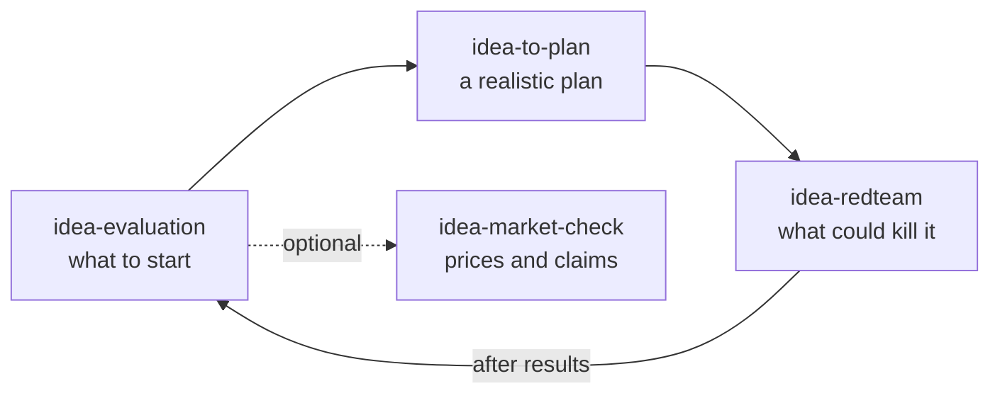

# Idea Evaluation Suite

   

> [!NOTE]
> **Public beta** · MIT licensed · [Changelog](CHANGELOG.md) · [Security](SECURITY.md) · [Contributing](CONTRIBUTING.md)
>
> Read [What we know so far](#what-we-know-so-far) before relying on the scores. Measured results: [evals/RESULTS.md](evals/RESULTS.md); sources and limits: [docs/RESEARCH.md](docs/RESEARCH.md).

**Decide which idea to start, plan it realistically, and try to break it before you spend time or money.**

[Who it is for](#who-it-is-for) · [Example](#example) · [Install](#install) · [Use](#use) · [Limits](#what-we-know-so-far) · [Contribute](CONTRIBUTING.md)

## Who it is for
- You have more ideas than time (side projects, a small business, inventions, a non-profit, research) and want **one next action** instead of a long report.
- You tend to stall on choosing. Evaluation and red-team answers are designed to name a first step of 30 minutes or less, and every test is meant to come with a stop rule agreed in advance; ideas you do not pick are parked with a revisit date, never deleted.
- **Not for:** deep market research (`idea-market-check` only checks prices and claims for one idea; use a dedicated research tool for more), legal, tax or financial advice, or everyday purchases.

## What we know so far
- In a small blind test (3 cases, LLM judges) the suite was **not** better overall than a plain Claude answer. It was stronger on one concrete first step with a stop rule and weaker on plain-language clarity and depth: [docs/COMPARISON.md](docs/COMPARISON.md).
- Scores are rough: weights and thresholds are uncalibrated, and the same prompt varies by about ±0.5 between runs.
- Not measured yet: whether the assistant picks the right skill on its own, and whether the design helps people with ADHD. Your feedback is the missing evidence: the [15-minute test](docs/TRY-IT.md) tells you what to try and where to send it.

## What the skills do
Four small, portable, user-neutral skills. Replies follow the user's language; the skills are written in English.

| Skill | Use it when | Output |
|---|---|---|
| [`idea-evaluation`](skills/idea-evaluation) | you have one or many ideas and need to know what to start, park or stop | ranked table, top-3 tests, next action (≤~450 words) |
| [`idea-to-plan`](skills/idea-to-plan) | you picked an idea and need analysis, MVP cut, milestones with gates and a realistic to-do list, or a weekly check-in | verdict, milestones, one task list (★ = today), review date |
| [`idea-redteam`](skills/idea-redteam) | you want an idea or plan attacked before committing time or money | Proceed / Fix first / Stop, max 3 weaknesses with a cheap test each |
| [`idea-market-check`](skills/idea-market-check) (optional, needs web search) | you want competitor prices, a claim or a statistic checked for one idea | named alternatives with price per unit, price position, claim check; never changes the evidence level |

How it differs from similar skills (and where those are stronger): [docs/COMPETITIVE-ANALYSIS.md](docs/COMPETITIVE-ANALYSIS.md); measured head-to-head: [docs/COMPARISON.md](docs/COMPARISON.md).

Flow: `idea-evaluation` → `idea-to-plan` → `idea-redteam` → (after results) `idea-evaluation` again; `idea-market-check` is an optional side trip for one idea. Each skill works alone; they hand over a small [Idea Card](docs/idea-card.md). Skills do not reliably call each other, so each ends with a "Next step" line and you invoke the next one.

## Example
**You write:**

> Rank: (1) spreadsheet course, (2) translator newsletter, (3) pill-reminder device, (4) repair marketplace, (5) rooftop solar tracker. Goal income, 6 h/week.

**You get:**

**Start with:** the spreadsheet course. Colleagues already ask for this and have paid for help (E2), so it has the strongest evidence at low cost. **Next, within 30 min:** write a 5-line course outline and send it to the 3 people who asked most recently.

| # | Idea | Adj. score | Evidence | Cost to MVP | Prio |
|---|---|---|---|---|---|
| 1 | Spreadsheet course | 3.5 | E2 | low | A |
| 2 | Translator newsletter | 3.2 | E0 | very low | B |

**Test:** at least 5 of 30 people in one role will pre-pay · **Time:** 10 days · **Pass if** ≥5 paid · **Stop if** ≤1

Excerpt with illustrative ratings; the full answer is in [example.md](skills/idea-evaluation/references/example.md).

## Install
1. **Download** the `<skill>.skill` files from the newest [release](https://github.com/Sae-l/Idea-Evaluation/releases) (v3.1.0-beta.2 or later) and verify them with `sha256sum -c SHA256SUMS`. Start with `idea-evaluation`; add the others when you need them.
2. **Add them to your tool:**
   - **Claude (claude.ai):** open the Skills page in Settings and upload the `.skill` file (menu names change from time to time).
   - **Claude Code:** `mkdir -p ~/.claude/skills && unzip idea-evaluation.skill -d ~/.claude/skills/` (a `.skill` file is a zip). In a project, use `.claude/skills/` instead.
   - **VS Code / GitHub Copilot:** `mkdir -p .github/skills && unzip idea-evaluation.skill -d .github/skills/`. VS Code also reads `.claude/skills/` and `.agents/skills/` according to its documentation; not tested by this project.
   - **ChatGPT / other chat tools:** paste `docs/chatgpt-<skill>.md` into a Custom GPT or Project and upload that skill's `references/` files as knowledge.
3. **Check that it works:** type `Evaluate these ideas: a paid spreadsheet course, a YouTube channel about woodworking. I have 6 hours a week.` You should get a ranked table, a "Start with" line and one first step of 30 minutes or less. In Claude Code, `~/.claude/skills/idea-evaluation/SKILL.md` should exist after step 2. A generic essay means the skill was not used: say `use the idea-evaluation skill`.

## Use
| You write | Skill | You get |
|---|---|---|
| "Rank these ideas ... I have 6 hours a week and EUR 500." | `idea-evaluation` | table, top-3 tests, first step |
| "Should I do this? ..." (one idea) | `idea-evaluation` | verdict, score, one test with a stop rule |
| "Plan idea X for 4 weeks" / "check in on my project" | `idea-to-plan` | milestones with gates, a realistic to-do list |
| "What could go wrong?" / "red-team this plan" | `idea-redteam` | Proceed / Fix first / Stop, up to 3 weaknesses |
| "Check the market for X" (web search needed) | `idea-market-check` | competitor prices, claim check |

Tips: say your hours per week, money and goal; say "assume, don't ask me questions" to skip questions; after you run a test, say "update: here is the result" and it re-scores only what changed.

Troubleshooting and FAQ

- **The skill does not start:** name it in the request ("use the idea-evaluation skill"). Triggering is not measured yet.
- **Too long:** ask for the "Quick" version.
- **Where do results go:** into an Idea Card ([format](docs/idea-card.md)); if files can be written, an `ideas.md` keeps your cards between sessions.
- **Spreadsheet:** see [Export](#export).
- **Privacy:** see [Privacy and safety](#privacy-and-safety).

## Privacy and safety
> [!IMPORTANT]
> - **Your ideas go to the AI provider you use** (Claude, ChatGPT, Copilot) under its terms. Do not paste secrets or confidential plans you are not allowed to share.
> - **`idea-market-check` searches the web:** search terms derived from your idea go to the search provider. The skill is told to use generic terms only.
> - **Saved files** (`ideas.md`, spreadsheets) contain what you typed. Keep them out of public repositories; this repository's `.gitignore` already excludes them.
> - **GitHub issues are public:** do not paste private ideas there. Report security problems privately: see [SECURITY.md](SECURITY.md).
> - The scripts run locally and make no network calls. Scores are rough estimates (±50 %), not professional, legal, financial or medical advice.

## Export
`python skills/idea-evaluation/scripts/build_xlsx.py ideas.json Ideas.xlsx` (`--csv` works without dependencies). JSON schema is in the script header. The Capacity sheet compares your load with 70 % of the hours you state (editable in Settings).

## How it works
1. **Gate:** desirability, feasibility, viability. A clear "no" stops the idea.
2. **Score:** six weighted criteria, rated 1-5, one criterion across all ideas at a time.
3. **Evidence adjustment:** opinion < behavior < commitment (E0-E4) lowers or keeps the score.
4. **Priority A-D** and a verdict (start, recycle, park, stop) within your weekly hours.
5. **Riskiest assumption** and the cheapest test with a numeric pass threshold.
6. **Unit economics, base rate and a pre-mortem** for the top idea; technology readiness and prior-art check for inventions.

Details load on demand from `references/` to save tokens.

For contributors and the curious: layout, quality, sources, roadmap

**Layout**

| Path | What it is |
|---|---|
| `skills/<skill>/SKILL.md` | core instructions, loaded when the skill triggers |
| `skills/<skill>/references/` | details loaded only when needed (`idea-card.md` and `tests.md` are identical copies) |
| `skills/idea-evaluation/scripts/` | `scoring.py` (logic and sensitivity check), `build_xlsx.py` (spreadsheet/CSV export) |
| `docs/` | `idea-card.md`, `RESEARCH.md`, `COMPETITIVE-ANALYSIS.md`, `COMPARISON.md`, `RELEASING.md`, `chatgpt-<skill>.md` |
| `tests/` | unit tests, spreadsheet-formula cross-check, skills-in-sync check |
| `evals/` | eval cases, results (`RESULTS.md`), output checkers, `trigger/` query sets |
| `dist/` | packaged `<skill>.skill` files (rebuilt by `tools/build_packages.py`, checked in CI) |
| `tools/`, `requirements-dev.txt` | package builder, test dependencies |
| `.github/` | CI, CodeQL, release workflow, issue and PR templates, Dependabot |
| root | `SECURITY.md`, `CONTRIBUTING.md`, `CODE_OF_CONDUCT.md`, `LICENSE`, `CHANGELOG.md` |

**Quality**
- Sources and confidence per design decision: [docs/RESEARCH.md](docs/RESEARCH.md).
- Measured results and open gaps: [evals/RESULTS.md](evals/RESULTS.md).
- After changes: `pip install -r requirements-dev.txt && python tests/run_all.py` (CI does the same).

**Roadmap:** measure trigger accuracy in real clients, run a blind test with real users, calibrate weights and thresholds from real outcomes, and fix the jargon that testers name most.

**Sources behind the method:** Desirability/Viability/Feasibility (IDEO), Stage-Gate (Cooper), Assumption Mapping (Bland & Osterwalder, *Testing Business Ideas*), Lean Startup, Jobs-to-be-Done, The Mom Test, Pretotyping, Effectuation (Sarasvathy), Pre-mortem (Klein), reference-class forecasting (Kahneman), ICE/RICE/WSJF, TRL. Base-rate example: US BLS Business Employment Dynamics.

Feedback from real use, especially from people with ADHD, is the most useful contribution: see the [issue forms](https://github.com/Sae-l/Idea-Evaluation/issues/new/choose).

License: [MIT](LICENSE).
